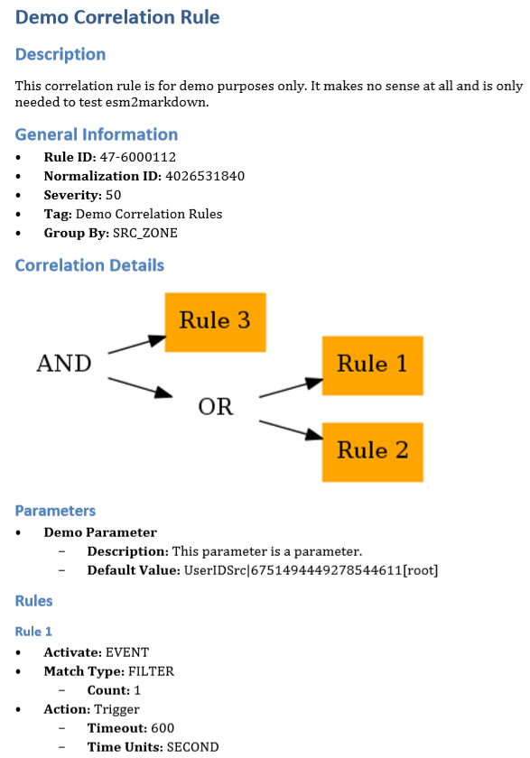

# esm2markdown

This python script is intended to be used to automatically generate use case / correlation rule documentation in Markdown format for the McAfee Enterprise Sceurity Manager (ESM). It accepts a XML file that has been exported from the correlation rule editor of the ESM, converts its contents to Markdown format and writes it into a new file. If you need any other format, you might want to use pandoc to convert to e.g. pdf, docx or HTML.

## Requirements

This tool requires the following:
* Python 3
* lxml 
* networkx
* pydot


On Debian you can install the dependencies with "sudo apt-get install python3-lxml python3-networkxi python3-pydot"

## Usage

```
python esm2markdown <rule xml file> <markdown output file>
```

## Example

```
python esm2markdown demo.xml demo.mk
```

After a conversion with pandoc, the following documentation will be the result:


